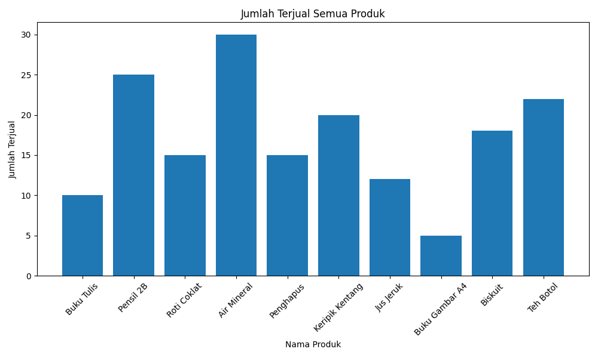
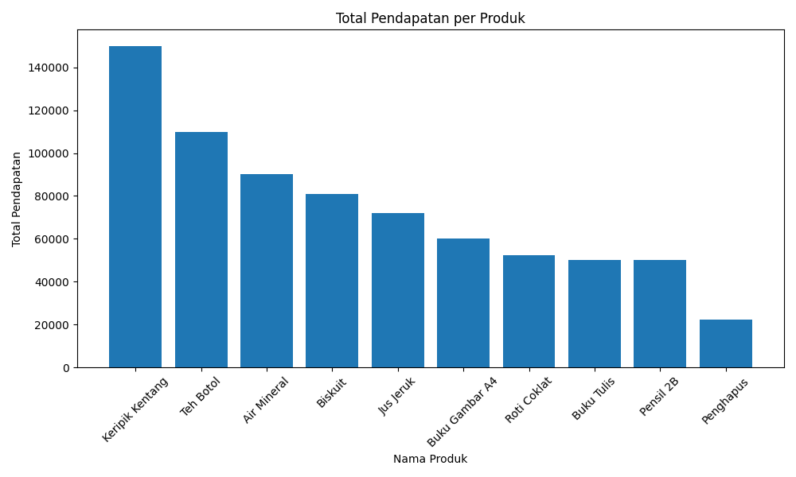
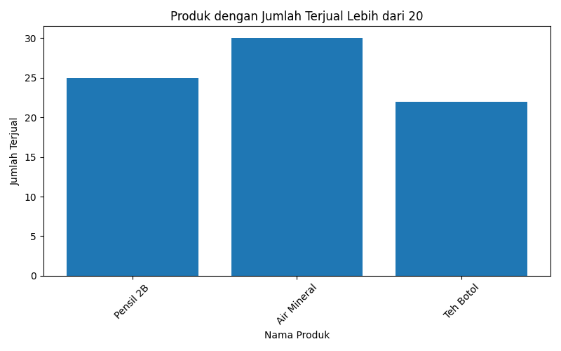

# Sales Data Analysis and Visualization 

## Overview
This project performs data analysis and visualization on product sales data using Python. The objective is to extract meaningful business insights such as total revenue, best-selling products, and sales performance. This project demonstrates fundamental data analysis workflows including data processing, aggregation, and visualization.

## Dataset

Dataset file used:

data_penjualan.csv

Dataset columns:

- Nama_Produk → Product name  
- Harga_Satuan → Price per unit  
- Jumlah_Terjual → Number of units sold  

## Analysis Performed

A new feature is created:

Total_Pendapatan = Harga_Satuan × Jumlah_Terjual

This enables:

- Total revenue calculation  
- Best-selling product identification  
- Revenue ranking per product  
- High-demand product filtering  

## Data Visualization

### Total Units Sold

### Total Revenue per Product

### Products Sold More Than 20 Units

## Files Generated

- category_summary.csv → Processed dataset with revenue calculation  
- total_revenue_per_product.png → Revenue visualization  
- produk_terlaris_lebih_20.png → High-demand products visualization  
- jumlah_terjual_semua_produk.png → Product sales volume visualization  

## Key Insights

### 1. Overall Revenue Performance
The total revenue generated is:

Rp 738,000

This reflects the overall business performance based on recorded sales data.

### 2. Best-selling Products
Top-selling products:

- Air Mineral — 30 units  
- Pensil 2B — 25 units  
- Teh Botol — 22 units  

These products have strong demand and represent important revenue drivers.

### 3. High-Profit Product Opportunity
Keripik Kentang generates high revenue despite lower sales volume, indicating premium pricing potential.

### 4. Growth Opportunity
Only 3 out of 10 products sold more than 20 units, indicating opportunities to improve marketing and sales strategies.

## Technologies Used

- Python 3.10  
- Pandas  
- Matplotlib  

## How to Run

Install dependencies:

pip install pandas matplotlib

Run analysis:

python data_analysis.py

Run visualization:

python data_visualization.py

## Project Structure

sales-data-analysis-python/
│
├── data_penjualan.csv
├── data_analysis.py
├── data_visualization.py
├── category_summary.csv
├── total_revenue_per_product.png
├── produk_terlaris_lebih_20.png
├── jumlah_terjual_semua_produk.png
└── README.md

## Author

Nadine Octavia Sales Data Analysis and Visualization 